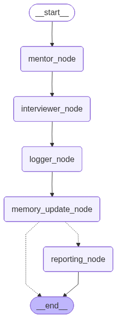

# 🧑‍💻 Multi-Agent Interview Coach (ITMO MegaSchool)

Этот репозиторий содержит финальный проект — **систему мульти-агентного ИИ-коуча** для проведения технических интервью. Проект разработан в рамках **MegaSchool ITMO** и использует современные LLM для симуляции реалистичных собеседований и автоматической валидации знаний кандидатов.

Система построена на базе **LangGraph** и оркестрирует работу нескольких агентов:

- **Interviewer Agent** – ведет собеседование, задает вопросы и реагирует на ответы.
- **Mentor Agent (Observer)** – наблюдает за ответами, проверяет факты, корректирует ход интервью и формирует директивы для интервьюера.
- **Logger & Memory** – сохраняет историю диалога, обновляет контекст и генерирует детальные отчеты.

---

## 🚀 Установка и Настройка

Проект использует современный менеджер зависимостей [uv](https://github.com/astral-sh/uv).

### 1. Предварительные требования
- Python 3.11+
- uv

Если `uv` не установлен:
```bash
pip install uv
````

### 2. Создание окружения и установка зависимостей

```bash
# Клонируем репозиторий
git clone <url-to-repo>
cd Multi-Agent-Interview-Coach_MegaSchool_ITMO

# Создание виртуального окружения
uv venv

# Активация окружения
# macOS/Linux
source .venv/bin/activate
# Windows
.venv\Scripts\activate

# Установка зависимостей из pyproject.toml
uv sync
```

### 3. Конфигурация (.env)

Создайте файл `.env` в корне проекта и добавьте свои API ключи:

```ini
API_KEY=<Ваш ключ API>
BASE_URL=<Базовый URL для API>
```

---

## 🛠 Использование

Проект поддерживает несколько режимов работы:

### 1. Веб-интерфейс (Streamlit)

Полноценный UI с чатом, настройками и панелью "Мысли агентов":

```bash
streamlit run app.py
```

*Доступно по адресу*: [http://localhost:8501](http://localhost:8501)

### 2. CLI Режим (Консоль)

Классический запуск через терминал:

```bash
python main.py
```

Следуйте инструкциям для ввода имени, грейда и ответов.

### 3. Режим Отладки (File Watcher)

Для быстрого тестирования сценариев без UI:

1. Настройте файл `user.yaml` с параметрами кандидата.
2. Запустите:

```bash
python debug_runner.py
```

3. Введите сообщение в `user_input.txt`.
4. Результаты появятся в `system_output.txt`.

---

## 🏗 Архитектура Системы

Система работает как **направленный граф состояний (State Graph)**.



### Поток данных (Flow)

1. **User Input** – сообщение пользователя поступает в граф.
2. **Mentor Node** – анализирует ответ, проверяет факты, формирует директиву для интервьюера.
3. **Interviewer Node** – получает директиву и генерирует следующий вопрос или реакцию.
4. **Logger Node** – сохраняет ход диалога в JSON формате.
5. **Memory Update** – обновляет краткое саммари текущего состояния интервью.
6. **Reporting Node** – генерирует детальный фидбэк, Roadmap и рекомендации.

### Файловая структура проекта

```text
.
├── agent/                  # Ядро логики агентов
│   ├── graph.py           # Определение графа LangGraph
│   ├── nodes.py           # Узлы агентов (Interviewer, Mentor, Logger)
│   ├── prompts.py         # Системные промпты и шаблоны
│   ├── models.py          # Pydantic модели данных
│   └── state.py           # Определение состояния (State)
├── app.py                  # Веб-приложение (Streamlit)
├── debug_runner.py         # Скрипт файловой отладки
├── main.py                 # CLI точка входа
├── logs/                   # Автоматически сохраняемые логи интервью
├── docs/                   # Документация и схемы
├── workshop_guides/        # Jupyter ноутбуки с воркшопами
├── pyproject.toml          # Зависимости проекта
└── system_output.txt       # Вывод дебаггера
```

---

## 📝 Логирование и Отчеты

Каждое интервью сохраняется в папку `logs/` с именем `interview_log_N.json`.

Каждый лог включает:

* Метаданные сессии (имя, грейд, дата, и т.д.).
* Полную историю ходов (Turns).
* Внутренние мысли агентов (`internal_thoughts`).
* Финальный фидбэк и рекомендации в формате JSON.

---

## 💡 Возможности проекта

* **Мульти-агентная архитектура** – один агент направляет другого для обеспечения качества интервью.
* **Автоматическая проверка фактов** – Mentor Agent анализирует ответы и выявляет ошибки.
* **Гибкие режимы работы** – Web UI, CLI и File Watcher.
* **Подробный отчет и Roadmap** – кандидат получает структурированный фидбэк с рекомендациями по развитию.

---

## 🙏 Благодарности

Особая благодарность:

* **Менторам и организаторам MegaSchool ITMO** за поддержку и обучение: [https://mega.itmo.ru/megaschool](https://mega.itmo.ru/megaschool)
* Всему коллективу ITMO, предоставившему платформу для реализации проекта.

---

## 📌 Заключение

Проект демонстрирует возможности создания сложных диалоговых систем, где LLM координируют друг друга для проведения качественных технических интервью. Система обеспечивает:

* реалистичное взаимодействие с кандидатом,
* автоматическую проверку знаний,
* структурированные отчеты с рекомендациями по развитию.

Это отличный пример применения мульти-агентного ИИ в образовательных и HR-технологиях.
